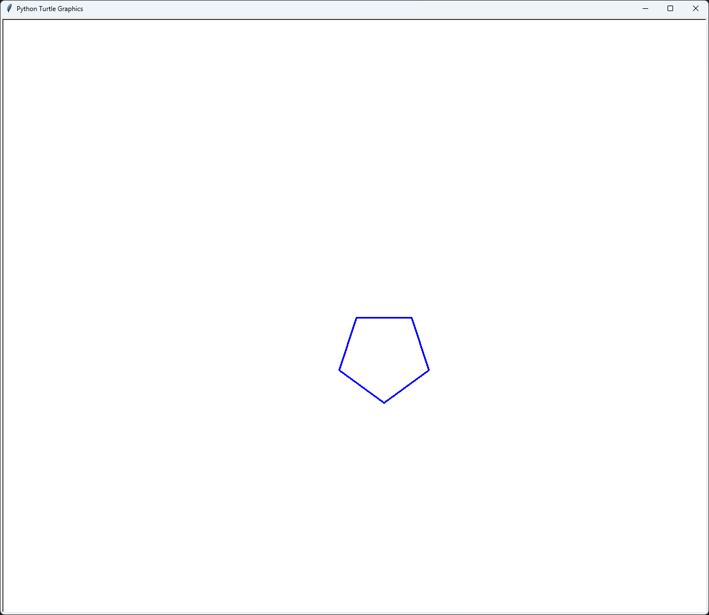

# ChatGPT를 이용한 오각형 그리기

## 목차

1. [사양](#사양)
2. [ChatGPT 질문](#chatgpt-질문)
3. [코드](#코드)
4. [결과](#결과)
5. [License](#license)

## 사양

- Python 3.11.4
- Poetry 1.6.1
- Visual Studio Code 1.82.2
- Windows 11 Pro

## ChatGPT 질문

```text
>>> Write a Python code which draws a pentagon, using turtle.
```

```text
You can use the Turtle graphics library in Python to draw a pentagon. First, make sure you
have the Turtle module installed. It's usually included in Python's standard library, so you
don't need to install it separately.

Here's a Python code that uses Turtle to draw a pentagon:
```

```python
import turtle

# Create a Turtle screen and a Turtle object
wn = turtle.Screen()
pentagon_turtle = turtle.Turtle()

# Function to draw a pentagon
def draw_pentagon():
    for _ in range(5):
        pentagon_turtle.forward(100)  # Adjust the length of sides as needed
        pentagon_turtle.right(72)    # 360 / 5 = 72 degrees for each turn

# Set up the Turtle's attributes
pentagon_turtle.speed(1)  # You can adjust the drawing speed (1 = slowest, 10 = fastest)
pentagon_turtle.penup()
pentagon_turtle.goto(0, 0)  # Move to the starting position
pentagon_turtle.pendown()

# Draw the pentagon
draw_pentagon()

# Close the Turtle graphics window when clicked
wn.exitonclick()
```

```text
This code will create a Turtle graphics window, and when you run it, a Turtle will draw a
pentagon. You can adjust the forward and right values to change the size and shape of
the pentagon as desired.
```

[원본](chatgpt.png)

더 정확한 답변을 얻기 위해 영어로 질문했습니다.

## 코드

```python
# Changed from the response by ChatGPT; See chatgpt.png
import turtle

# Create a Turtle screen and a Turtle object
screen = turtle.Screen()
pentagon_turtle = turtle.Turtle()


# Function to draw a pentagon
def draw_pentagon():
    for _ in range(5):
        pentagon_turtle.forward(100)  # Adjust the length of sides as needed
        pentagon_turtle.right(72)  # 360 / 5 = 72 degrees for each turn


# Set up the Turtle's attributes
pentagon_turtle.speed(1)  # You can adjust the drawing speed (1 = slowest, 10 = fastest)
pentagon_turtle.pencolor("#0000FF")  # You can change the pen color
pentagon_turtle.pensize(3)  # You can adjust the pen width

# Move the Turtle to a starting position
pentagon_turtle.goto(0, 0)  # Move to the starting position
pentagon_turtle.pendown()  # Put the pen down

# Draw the pentagon
draw_pentagon()

# Hide the Turtle cursor
pentagon_turtle.hideturtle()

# Close the Turtle graphics window when clicked
screen.exitonclick()
```

[원본](main.py)

## 결과



## License

Copyright (c) Minjoon Kim. All rights reserved.

Licensed under the [MIT](LICENSE) license.
